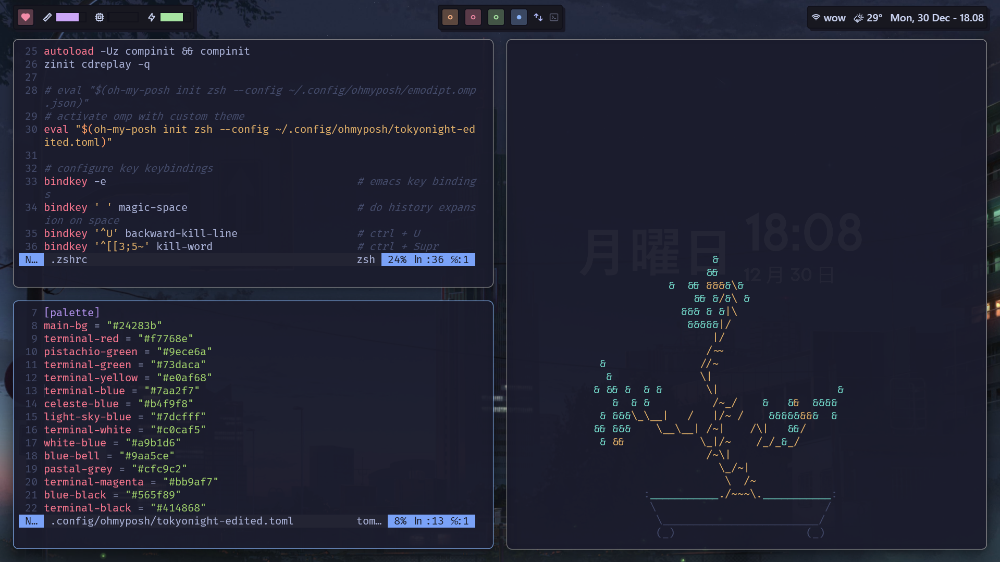
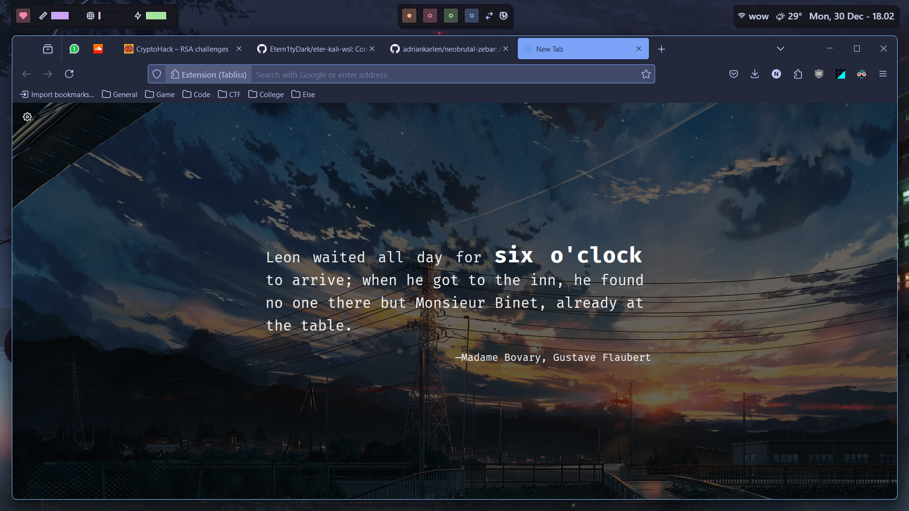
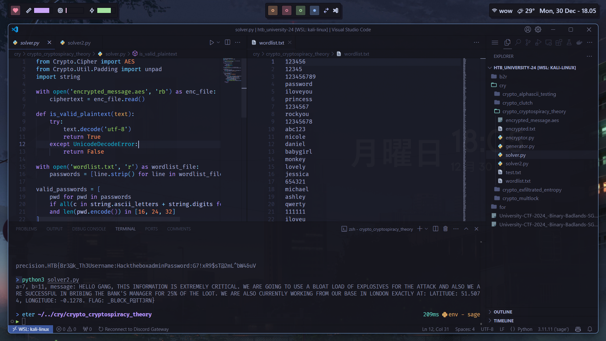
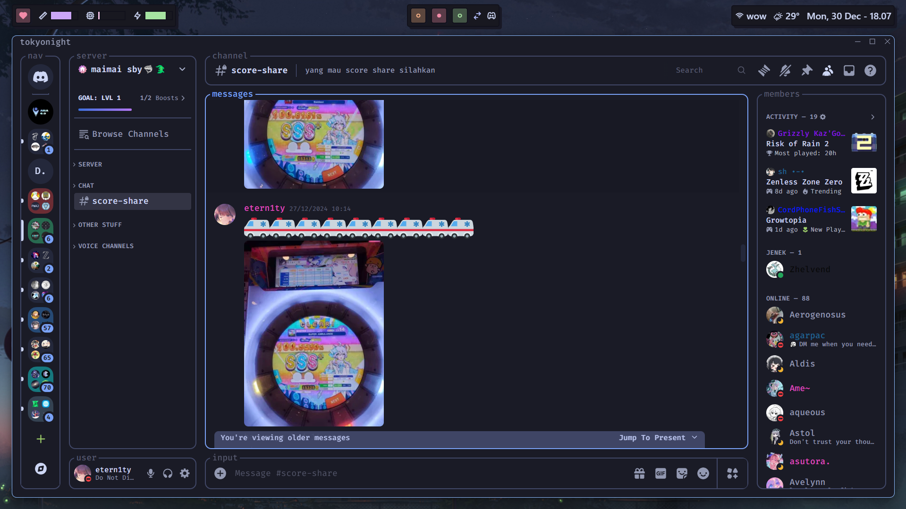

# Etern1ty's Windows 11 Setup

Mainly consists of Tokyo Night color schemes/theming (lmao). Currently running:

- Firefox > [Tokyo-Night-Storm-Modified](https://addons.mozilla.org/en-US/firefox/addon/tokyo-night-storm-modified/)

- ohmyposh (same setup as my [WSL setup](https://github.com/Etern1tyDark/eter-kali-wsl))
  
- GlazeWM (defaults) w/ Zebar ([neobrutal-zebar](https://github.com/adriankarlen/neobrutal-zebar) modified)
  
- Visual Studio Code
    - Tokyo Night by enkia
    - Palenight Material Theme Icons
  
- Vencord > system24 (tokyonight) modified

- Windows Terminal > Tokyo Night
    - FiraCode NF
  
- Wallpaper Engine > [Tokyo Night](https://steamcommunity.com/sharedfiles/filedetails/?id=3022212170)

## Gallery

